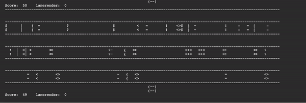

# Crossy-road
- Replicating the video game crossy road in Python.
# Crossy road demo:

# Crossy Road
- Version of crossy road with only one level, when the user gets to the end of the display he will come back to the start of the display.
# Crossy Road experimental
- Experimental version of crossy road
- The lanes will move towards the user when he moves
- game has 5 levels which change the speed and frequency of obstacles
- High score board is now done, with text file storage using shelve
# How to play
- Press control + c to move foreward
- if you hit an object, you lose
- score is calculated by 50 - seconds passed + (100 x times jumped)
# What is to be done
- have multiple lanes one after another without break
- have stream with logs that the users must use.
- have objects moving in opposite directions.
- user can move foreward, back, left and right (right now, user can just move foreward)
# Bugs
- if you hold control + c then you never lose (SOLVED)
- if you keep on holding control c when you lose, program crashes (SOLVED)
- if you keep holding control c when you lose, it adds you name and score to the scoreboard multiple times (SOLVED)
